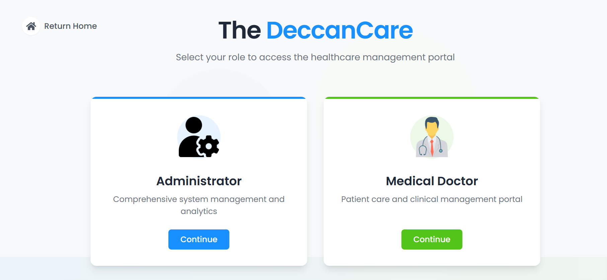
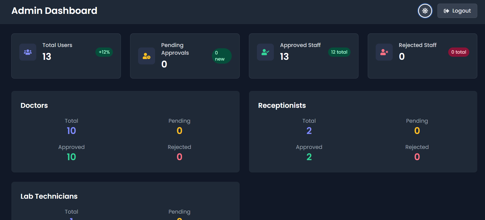
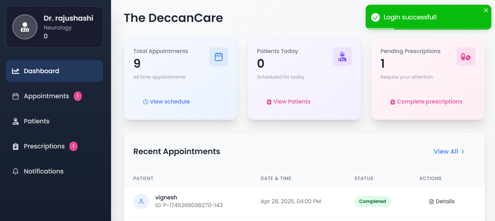
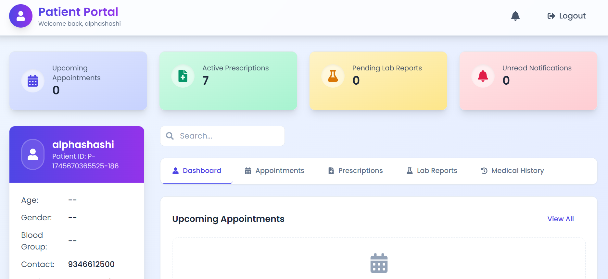
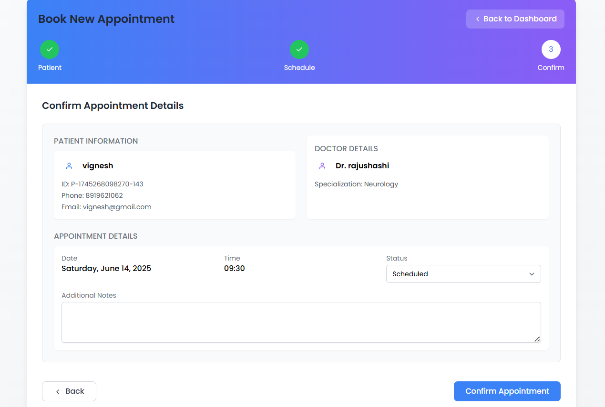
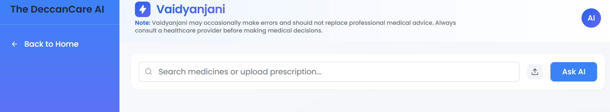

Hospital Management System
A comprehensive, full-stack web-based Hospital Management System designed to streamline patient care, administrative processes, and communication between staff and patients. This system supports multi-role access and integrates AI-assisted features to improve healthcare delivery.

<div align="center">
  
  [](https://nodejs.org/)
  [](https://expressjs.com/)
  [](https://www.mongodb.com/)
  [](https://mongoosejs.com/)
</div>

## 📋 Overview

The Hospital Management System (HMS) is a comprehensive full-stack application designed to streamline hospital operations and enhance patient care management. This system provides a robust platform for managing patient information, appointments, medical records, and hospital staff operations.

## ✨ Key Features

- **Role-Based Access Control**
  - Admin Dashboard
  - Doctor Portal
  - Receptionist Interface
  - Lab Technician Module

- **Patient Management**
  - Custom Patient ID Generation
  - Complete Patient History
  - Medical Records Management
  - Appointment Scheduling

- **Staff Management**
  - Doctor Management
  - Receptionist Management
  - Lab Technician Management
  - Role Assignment

- **Medical Records**
  - Diagnosis Management
  - Prescription Tracking
  - Lab Test Results
  - Treatment History

- **AI-Powered Features**
  - Vaidyanjani AI Assistant
  - Prescription Analysis
  - Medicine Information Lookup
  - PDF Prescription Processing
  - Drug Details and Side Effects

## 🖥️ Screenshots

<div align="center">
  <h3>Application Screenshots</h3>
  
  <table>
    <tr>
      <td></td>
      <td></td>
    </tr>
    <tr>
      <td></td>
      <td></td>
    </tr>
    <tr>
      <td></td>
      <td></td>
    </tr>
    <tr>
      <td colspan="2"></td>
    </tr>
  </table>
</div>

## 🛠️ Technology Stack

### Backend
- **Node.js** - JavaScript runtime environment
- **Express.js** - Web application framework
- **MongoDB** - NoSQL database
- **Mongoose** - MongoDB object modeling
- **JWT** - Authentication and authorization
- **Bcrypt** - Password hashing

### Frontend
- **React.js** - Frontend framework
- **Material-UI** - Component library
- **Redux** - State management
- **Axios** - HTTP client

## 🚀 Getting Started

### Prerequisites
- Node.js (v14 or higher)
- MongoDB
- npm or yarn

### Installation

1. Clone the repository
```bash
git clone https://github.com/yourusername/hospital-management-system.git
cd hospital-management-system
```

2. Install dependencies
```bash
# Install backend dependencies
cd backend
npm install

# Install frontend dependencies
cd ../frontend
npm install
```

3. Configure environment variables
```bash
# Create .env file in backend directory
cp .env.example .env
```

4. Start the application
```bash
# Start backend server
cd backend
npm start

# Start frontend development server
cd frontend
npm start
```

## 📚 API Documentation

### Authentication Endpoints
- `POST /api/auth/login` - User login with email and password
- `POST /api/auth/register` - Register new user (Admin only)
- `GET /api/auth/profile` - Get authenticated user profile
- `PUT /api/auth/profile` - Update user profile
- `GET /api/auth/logout` - Logout user

### Patient Endpoints
- `GET /api/patients` - Get all patients (with pagination)
- `POST /api/patients` - Create new patient record
- `GET /api/patients/:id` - Get patient by ID
- `GET /api/patients/custom/:customId` - Get patient by custom ID
- `PUT /api/patients/:id` - Update patient details
- `PUT /api/patients/custom/:customId` - Update patient by custom ID
- `DELETE /api/patients/:id` - Delete patient record

### Appointment Endpoints
- `GET /api/appointments` - Get all appointments
- `POST /api/appointments` - Create new appointment
- `GET /api/appointments/:id` - Get appointment by ID
- `PUT /api/appointments/:id` - Update appointment
- `DELETE /api/appointments/:id` - Delete appointment
- `GET /api/appointments/patient/:patientId` - Get appointments by patient ID
- `GET /api/appointments/doctor/:doctorId` - Get appointments by doctor ID

### Medical Records Endpoints
- `GET /api/records` - Get all medical records
- `POST /api/records` - Create new medical record
- `GET /api/records/:id` - Get medical record by ID
- `PUT /api/records/:id` - Update medical record
- `DELETE /api/records/:id` - Delete medical record
- `GET /api/records/patient/:patientId` - Get medical records by patient ID

### Staff Management Endpoints
- `GET /api/staff` - Get all staff members
- `POST /api/staff` - Add new staff member (Admin only)
- `GET /api/staff/:id` - Get staff member by ID
- `PUT /api/staff/:id` - Update staff member details
- `DELETE /api/staff/:id` - Remove staff member (Admin only)
- `GET /api/staff/doctors` - Get all doctors
- `GET /api/staff/receptionists` - Get all receptionists
- `GET /api/staff/lab-technicians` - Get all lab technicians

### Lab Test Endpoints
- `GET /api/lab-tests` - Get all lab tests
- `POST /api/lab-tests` - Create new lab test
- `GET /api/lab-tests/:id` - Get lab test by ID
- `PUT /api/lab-tests/:id` - Update lab test results
- `DELETE /api/lab-tests/:id` - Delete lab test
- `GET /api/lab-tests/patient/:patientId` - Get lab tests by patient ID

## 🤖 AI Integration

### Vaidyanjani AI Assistant
The system integrates Google's Gemini 1.5 Pro model to provide intelligent medical assistance through the Vaidyanjani AI interface.

#### Features
- **Smart Prescription Analysis**
  - PDF prescription upload and processing
  - Automatic medicine name extraction
  - Detailed drug information retrieval
  - Side effects and precautions analysis

- **Medicine Information System**
  - Comprehensive drug details
  - Side effects information
  - Usage precautions
  - Dosage recommendations
  - Drug interactions

- **User-Friendly Interface**
  - Clean and intuitive design
  - Real-time search capabilities
  - PDF upload support
  - Responsive results display

### AI Endpoints
- `POST /api/search` - Search for medicine information
- `POST /api/upload` - Upload and analyze PDF prescriptions
- `GET /api/health` - Check AI service health status

### Technical Implementation
- **Frontend**: React.js with modern UI components
- **Backend**: Node.js with Express
- **AI Model**: Google Gemini 1.5 Pro
- **File Processing**: PDF parsing and text extraction
- **Data Format**: JSON responses with structured medicine information

## 🤝 Contributing

1. Fork the repository
2. Create your feature branch (`git checkout -b feature/AmazingFeature`)
3. Commit your changes (`git commit -m 'Add some AmazingFeature'`)
4. Push to the branch (`git push origin feature/AmazingFeature`)
5. Open a Pull Request

## 📝 License

This project is licensed under the MIT License - see the [LICENSE](LICENSE) file for details.

## 👥 Authors

- Your Name - Initial work - [shashidhar078](https://github.com/shashidhar078)

## 🎉 Acknowledgments

- Special thanks to [vigneshwar315](https://github.com/vigneshwar315) for his invaluable contribution and partnership in developing this project


---

<div align="center">
  Made with ❤️ by [Shashidhar Nagunuri]
</div>

